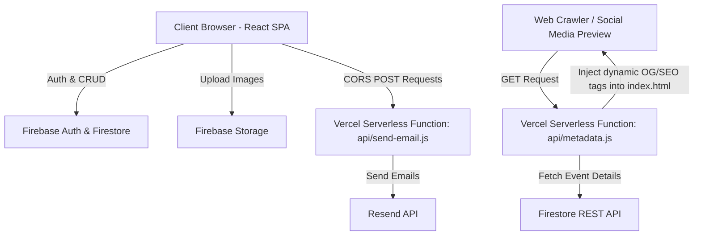

# 📸 Capture Crew - Photography Club Portal

[](https://vitejs.dev/)
[](https://reactjs.org/)
[](https://firebase.google.com/)
[](https://vercel.com/)
[](https://resend.com/)

A premium, cinematic showcase platform and administration suite for **Capture Crew**, the official photography club of Cooch Behar Government Engineering College (CGEC). This portal serves as a digital gallery, recruitment dashboard, and certificate verification center.

---

##  System Architecture & Data Flow



---

##  Technical & Architectural Highlights

- **Dynamic SEO & OpenGraph Tag Injection**: Built a custom serverless middleware (`api/metadata.js`) on Vercel Edge. Before serving `index.html` to crawlers (like Facebook, Twitter, WhatsApp), it intercepts requests, fetches details from Firestore REST endpoints, and dynamically writes OpenGraph (`og:*`) and Twitter cards tags directly into the header to support rich social previews.
- **RFC 8058 Compliant One-Click Unsubscribe**: Fully compliant unsubscription backend handler (`api/unsubscribe.js`) supporting standard list-unsubscribe headers. Features GET redirection and POST execution to mark subscribers as inactive (`active: false`) in Firestore.
- **Client-Side Image Optimization**: Implemented custom bulk/single uploads equipped with client-side image compression (`browser-image-compression` + `react-dropzone`) reducing bandwidth and storage costs in Firebase.
- **Progressive Image Loading**: Custom `BlurUpImage` component displaying a low-resolution blurred placeholder while high-res images load progressively.
- **Dynamic Site Maintenance**: Dynamically toggled maintenance screen via Firestore global configuration to block public pages with customized markdown notices.

---

##  Portal Layout & Page Breakdown

###  Public Pages

1. **Home**: High-quality cover photo carousel, highlight showcases for "Capture of the Week" and "Capture of the Month", a live event banner, custom-built page transition animations, and site-wide theme configurations fetched dynamically from Firebase.
2. **About Us**: Interactive visual timeline detailing the history, core values, mission, and milestones of CGEC's Photography Club.
3. **Gallery**: Curated showcases categorized into *Weekly Captures*, *Monthly Captures*, and *The Extra Frame*. Supports category-based filtering, lightbox zooming, and automated metadata parsing (Title, Photographer name, Department, Graduation Year).
4. **Events**: Details on past, present, and upcoming photography events. Hosts schedules, guidelines, awards, and submission timelines.
5. **Events Gallery**: Dedicated image grids aggregating user-submitted photography showcases and highlights from past campus festivals.
6. **Team**: Directory organizing club coordinators, core committee, and general members with custom department/year filters and direct social/portfolio connections.
7. **Verify**: Public verification gate allowing recruiters and organizations to check the validity of certificates issued by the club by querying serial numbers (e.g. `CC-2024-001`) against the certificates database.
8. **Join**: Interactive multi-step recruitment application form collecting name, email, roll number, gear specs (camera/phone model), portfolio links, and motivation statements.
9. **Contributors**: A hall of fame highlighting developers, system administrators, and contributors behind the creation and upkeep of the platform.
10. **Privacy Policy**: A standard-compliant privacy disclosure detailing data collection, storage safety, and cookies management.

---

###  Admin Console (`/admin`)

A secure administrative dashboard protected via Firebase Authentication, cross-checking privileges against an authorized list of administrators. It features:

- **Dashboard Metrics**: Real-time counts of members, applications, certificates, and gallery items.
- **Theme Settings**: Dynamic theme customizer modifying site-wide visual identities instantly.
- **Cover Photo Slider**: Add, reorder, or delete slides featured in the homepage banner.
- **Gallery Manager**: Single/Bulk uploads with compression, custom category tagging, and delete actions.
- **Event Coordinator**: Create new event profiles, manage submission folders, and toggle event visibility status.
- **Team Roster**: Direct drag-and-drop ordering of committee members, edit titles, and update profile avatars.
- **Certificate Issuer**: Search, view, delete, or batch-issue (via CSV uploads) authentic verifiable certificate credentials.
- **Recruitment Review**: Read incoming applications, evaluate gear/portfolios, mark as reviewed, or delete submissions.
- **Maintenance Switch**: Toggle global maintenance wall on/off, with customizable markdown notice editors.

---

##  API Integrations

### 1. Resend Email API
Used for sending transactional notifications and marketing newsletters:
- **Batch Sending**: Leverages Resend's batch delivery `/emails/batch` for mass notifications.
- **Transactional Alerts**: Dispatches confirmations when a user applies for recruitment or requests certificates.
- **RFC 8058 Header Integration**: Pairs with `api/unsubscribe.js` for one-click email clients integration.

### 2. Firestore REST API
Used in serverless edge environments (`api/metadata-utils.js`) to fetch documents directly over HTTP without loading full Firebase SDK bundles, maximizing response latency and Edge performance.

---

##  Firebase Firestore Schema

| Collection Name | Document / Fields Description |
| :--- | :--- |
| **`members`** | Details of regular club members, status, and join dates. |
| **`team_members`** | Active committee roster, designations, order rankings, departments, and years. |
| **`gallery`** | Image paths, category, title, photographer name, department, year, and uploads timestamps. |
| **`events`** | Event metadata, schedule timelines, categories, order indices, and submissions. |
| **`cc_events`** | Capture Crew special/local event records. |
| **`config`** | Config documents: `covers` (homepage slideshow), `theme` (global themes), `live_event`, `site`. |
| **`maintenanceSettings`** | Global document `global` managing `{ enabled: boolean, message: string, title: string }`. |
| **`admins`** | Document IDs represent emails of authorized administrators with metadata permissions. |
| **`certificates`** | Serialized credentials map: `serialNo`, `name`, `event`, `date`, `role`. |
| **`applications`** | Submissions from recruitment portal: gear, motivation, contact details, status. |
| **`subscribers`** | Newsletter subscription records: email, subscription timestamp, active status. |

---

##  Getting Started

### Prerequisites
- Node.js (v18 or higher recommended)
- A Firebase project (Authentication, Firestore Database, and Storage enabled)
- A Resend API Key

### Installation

1. Clone the repository:
   ```bash
   git clone https://github.com/arkadeb69/CGEC_Capture_Crew.git
   cd CGEC_Capture_Crew
   ```

2. Install the dependencies:
   ```bash
   npm install
   ```

3. Create a `.env` file in the root directory and add the configuration keys:
   ```env
   VITE_FIREBASE_API_KEY=your_api_key
   VITE_FIREBASE_AUTH_DOMAIN=your_auth_domain
   VITE_FIREBASE_PROJECT_ID=your_project_id
   VITE_FIREBASE_STORAGE_BUCKET=your_storage_bucket
   VITE_FIREBASE_MESSAGING_SENDER_ID=your_sender_id
   VITE_FIREBASE_APP_ID=your_app_id
   
   RESEND_API_KEY=your_resend_api_key
   ```

4. Run the development server:
   ```bash
   npm run dev
   ```

5. Build for production:
   ```bash
   npm run build
   ```

---

*Framing Moments. Preserving Memories.*
